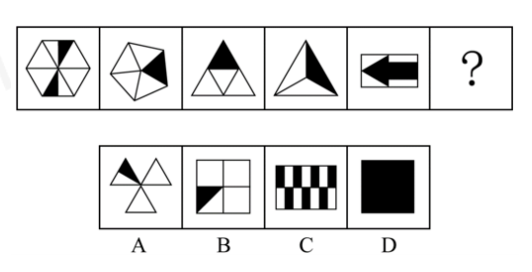
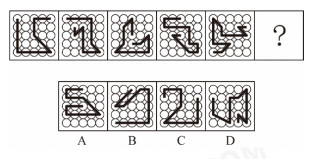
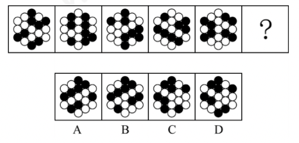
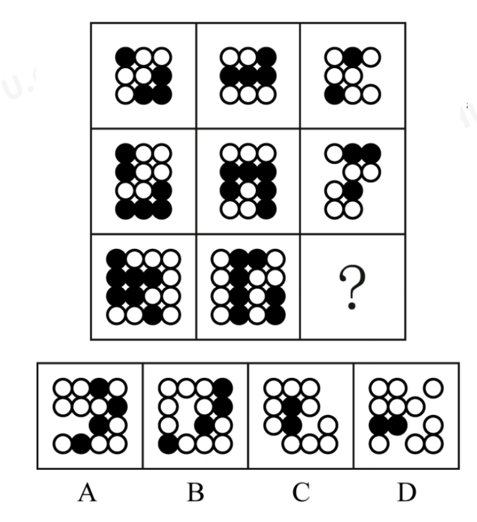
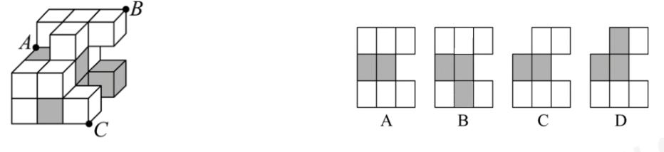
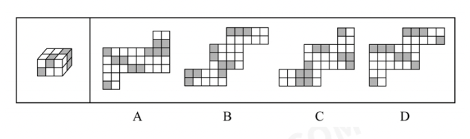
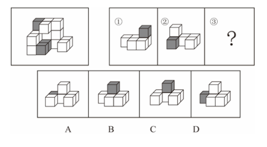
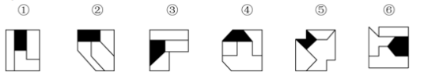
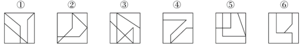
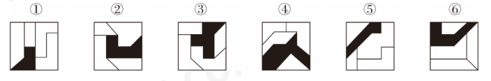

76.（单选题）从所给的四个选项中选择最合适的一项填入问号处，使之呈现一定的规律性：

A.如上图所示  
B.如上图所示  
C.如上图所示  
D.如上图所示  

77.（单选题）从所给的四个选项中，选择最合适的一项填入问号处，使之呈现一定的规律性：

A.如上图所示  
B.如上图所示  
C.如上图所示  
D.如上图所示  

78.（单选题）从所给的四个选项中，选择最合适的一项填入问号处，使之呈现一定的规律性：

A.如上图所示  
B.如上图所示  
C.如上图所示  
D.如上图所示  

79.（单选题）从所给的四个选项中，选择最合适的一项填入问号处，使之呈现一定的规律性：

A.如上图所示  
B.如上图所示  
C.如上图所示  
D.如上图所示  

80.（单选题）左图为13个白色正方体和5个灰色组合而成的多面体，现用经A、B、C三个顶点的平面对该
多面体进行切割，正确的截面是：

A.如上图所示  
B.如上图所示  
C.如上图所示  
D.如上图所示  

81.（单选题）左图为8个白色正方体和4个灰色正方体粘接而成的长方体，问以下哪个可能是其外表面展

A.如上图所示  
B.如上图所示  
C.如上图所示  
D.如上图所示  

82.（单选题）左图为15个白色正方体和3个灰色正方体组合而成的多面体，其可以由①、②、③三个多面
体组合而成，问哪项能填入问号处？

A.如上图所示  
B.如上图所示  
C.如上图所示  
D.如上图所示 

83.（单选题）把下面的六个图形分为两类，使每一类图形都有各自的共同特征或规律，分类正确的一项
是：

A.①②⑥，③④⑤ 
B.①③④，②⑤⑥ 
C.①③⑥，②④⑤ 
D.①③⑤，②④⑥

84.（单选题）把下面的六个图形分为两类，使每一类图形都有各自的共同特征或规律，分类正确的一项

A.①⑤⑥，②③④ B.①②⑥，③④⑤ C.①③④，②⑤⑥ D.①④⑤，②③⑥

85.（单选题）把下面的六个图形分为两类，使每一类图形都有各自的共同特征或规律，分类正确的一项
是：

A.①②⑥，③④⑤
B.①④⑥，②③⑤
C.①②③，④⑤⑥
D.①③⑤，②④⑥

