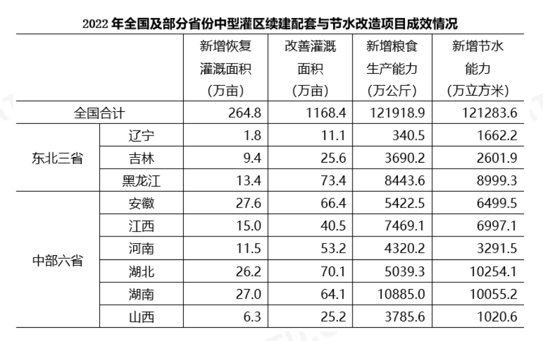
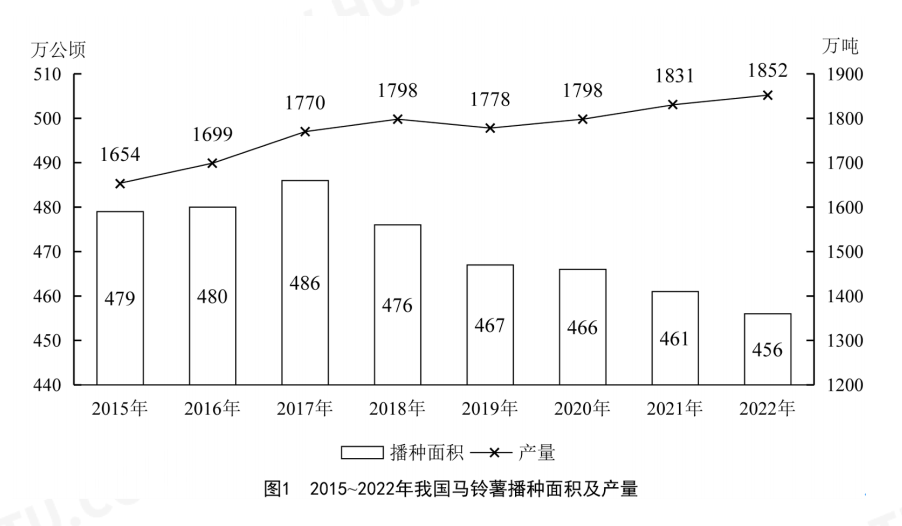
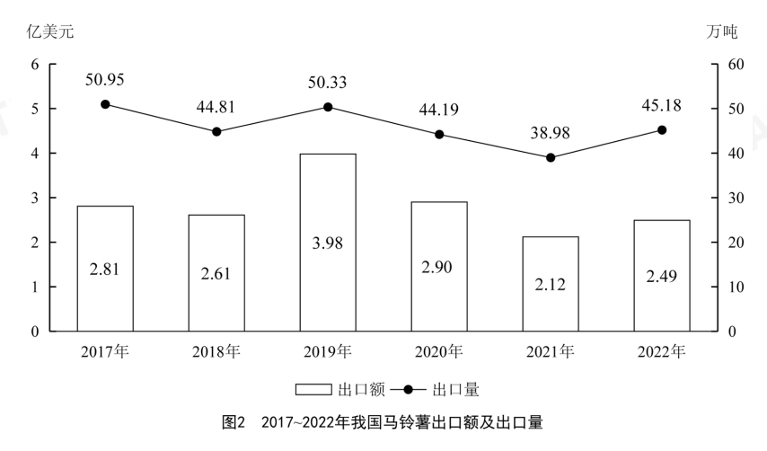

118.(单选题)2022年，中部六省中型灌区新增节水能力占全国中型灌区的：
A.不到三成
B.一半以上
C.三成多
D.四成多

120.(单选题)2022年全国粮食产量同比增加368万吨。如全国中型灌区新增粮食生产能力均得到充分利
用，则中部六省中型灌区新增粮食生产能力对全国粮食增产的贡献占比为：
A.不到2%
B.超过9%
C.2%—5%之间
D.5%一9%之间

123.（单选题)2017一2022年我国马铃薯出口量最高的年份，当年出口额在这6年中排名：
A.第一
B.第二
C.第三
D.第四

124.(单选题)2020一2022年，我国马铃薯出口量占产量的比重呈现何种变化趋势：
A.先降后升
B.先升后降
C.持续上升
D.持续下降

