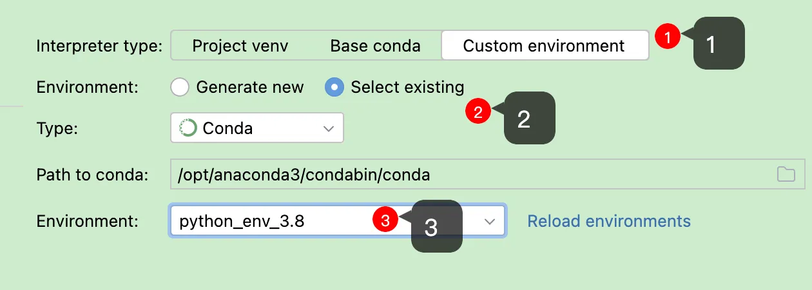

## 搭建 anaconda 环境

### anaconda简介
Anaconda简介


### Anaconda下载
https://mirrors.tuna.tsinghua.edu.cn/anaconda/archive/?C=M&O=D
选择Anaconda3-2024.10-1-MacOSX-x86_64.pkg下载

### Anaconda安装
下载完成后，双击.pkg文件进入图形界面
按默认设置即可，安装需要花费一段时间

### Anaconda加入环境变量
1、打开终端窗口
同时按下command键和空格键，在聚焦搜索中输入"终端"，双击进入终端

2、将conda加入环境变量
加入环境变量是为了让系统能识别conda命令
vim ~/.bash_profile
```shell
export PATH="/opt/anaconda3/bin:$PATH"
# >>> conda initialize >>>
__conda_setup="$('/opt/anaconda3/bin/conda' 'shell.bash' 'hook' 2> /dev/null)"
if [ $? -eq 0 ]; then
    eval "$__conda_setup"
else
    if [ -f "/opt/anaconda3/etc/profile.d/conda.sh" ]; then
        . "/opt/anaconda3/etc/profile.d/conda.sh"
    else
        export PATH="/opt/anaconda3/bin:$PATH"
    fi
fi
unset __conda_setup
# <<< conda initialize <<<
```
修改完成后，先按esc键退出编辑模式，再输入:wq!并回车，以保存退出
验证是否能识别conda命令：
在终端中输入source ~/.bash_profile以更新环境变量
再在终端输入conda info --envs，若能显示当前有base环境，则conda已加入环境变量

### 创建新的conda环境
```shell
# 在命令行输入以下命令，创建名为paddle_env的环境
# 此处为加速下载，使用清华源
conda create --name paddle_env python=3.8 --channel https://mirrors.tuna.tsinghua.edu.cn/anaconda/pkgs/free/
```
该命令会创建1个名为paddle_env、python版本为3.8的可执行环境，根据网络状态，需要花费一段时间
之后命令行中会输出提示信息，输入y并回车继续安装

### 激活刚创建的conda环境
在命令行中输入以下命令：
```shell
# 激活paddle_env环境
conda activate paddle_env 
# 查看当前python的位置
where python
```

### 如何在激活的conda环境中安装包
conda install numpy --channel https://mirrors.tuna.tsinghua.edu.cn/anaconda/pkgs/free/

‌conda-forge是由社区维护的一个Conda通道，提供了许多开源软件包，这些软件包可能不在默认的Conda通道中提供‌。conda-forge是Anaconda包管理器的一部分，它允许用户从该通道安装额外的软件包。‌

conda install -c conda-forge lxml


## pycharm 使用 anaconda 环境
### 新建项目选择自定义环境中的anaconda
pycharm 创建项目时，使用 anaconda 搭建环境。


### 新建py文件
```python
# coding:utf-8

```