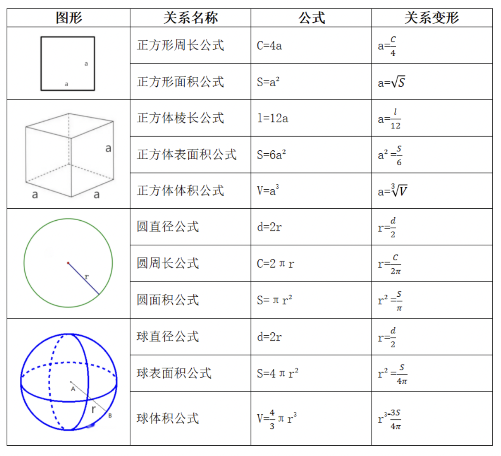
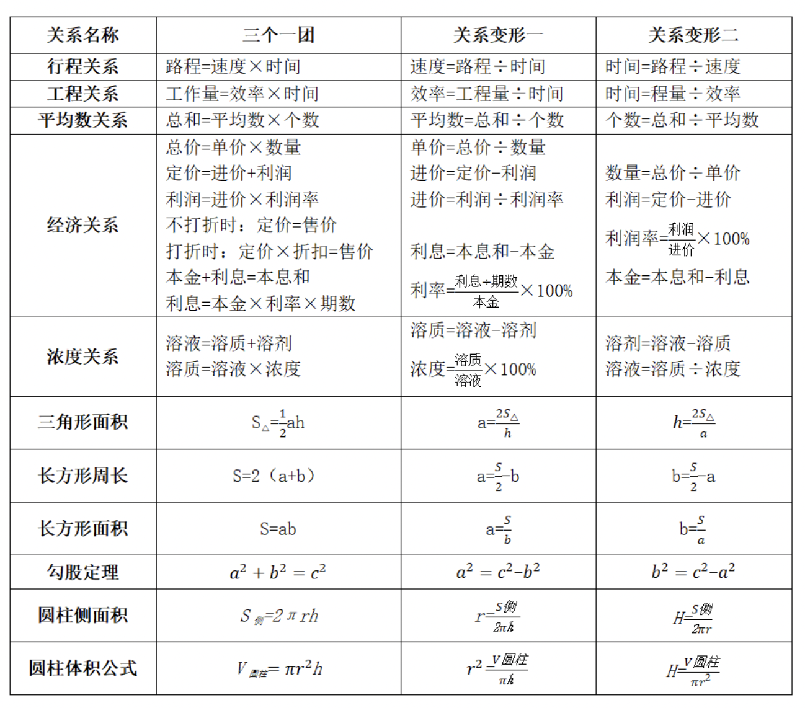
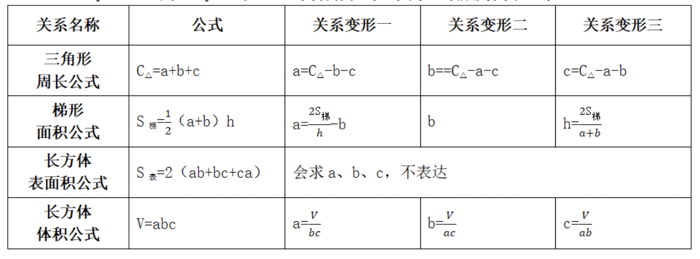

认识大纲
那么数量关系究竟在考察什么呢？大纲是这样表述的：数量关系主要测查报考者理解、把握事物间量化关系和解决数量关系问题的能力，主要涉及数据关系的分析、推理、判断、运算等。常见的题型有：数字推理、数学运算等。
从以上表述可以得出这样的结论：数学运算考察重点并不在于运算，运算只是末端的，真正考察的是一种能力，分析、推理的能力，而很多考生受一些鱼龙混杂机构影响，要不就是一堆方程，要不就是过分追求技巧，舍本逐末，没有充实质上提升能力！万丈高楼平地起，只有掌握好基础，才能施展秒杀技！
因此本次课程以基础思维入手，从审题与读题技巧、实战秒杀思维深入挖掘数量背后的本质，让大家有从“道”中领略，“质”中提升，接下来我们开始深入的学习。


汉语数学翻译词典

| 应用题部分 |  |
| --- | --- |
| 1.相等，相当于，是，为 | = |
| 2.大于，多于 | > |
| 3.不小于，至少 | ≥ |
| 4.大于，少于 | < |
| 5.不大于，至多， | ≤ |
| 6.和，放在一起，共计 | + |
| 7.a于b的和，a加上b | a+b |
| 8.差，去掉 | 一 |
| 9.a于b的差，a减去b | a-b |
| 10.乘以，倍，积 | × |
| 11.扩大到n倍 | Xn |
| 12.多n倍 | ×(n+1) |
| 13.除以，除，商 | ÷ |
| 14.a除以b | ab |
| 15.a除b | b÷a |
| 16.缩小到原先的1/n, | ÷n |
| 17.a、b、c依次成等差 |  2b=a+c |
| 18.a、b、c依次成等比 | b²=ac |
| 汉语关键词，一步推理 |  |
| 1.每，单位 | 平均 |
| 2.一共，总共，合计 | 加在一起 |
| 3.最大，尽量大 | 和同差小积大 |
| 4.最小，尽量小 | 和同差大积小 |
| 5.至少，不多余 | 多种情况，反面排除 |
| 6.自然数 | 0, 1, 2, 3, 4........ |
| 7.奇数 8.偶数 | 1,3,5, 7......2n-1 0, 2, 4, 6......2n |
| 9.质数 | 因数只有1和本身；如2,3,5,7,11.. |
| 10.偶质数 | 只有一个2 |
| 11.合数 | 可以分解质因数，因数个数大于2 |
| 12.浓度x% | 溶质占溶液的百分比 |
| 13.利润率x% | 利润占成本的百分比 |


三、两个一伙、三个一团、四个一帮
两个一伙、三个一团、四个一帮组成数学知识体系，它们多是以公式或知识点出现，
需要熟记这些公式，加上较高的分析能力、加工能力，数学题目才得以解答完毕，缺一
不可。
下面给出数学上的两个一伙、三个一团、四个一帮构成的知识点或公式，需要大家
熟记基本公式，特殊的公式变形也要掌握一些，要想到是由基本公式进行逆运算表达出
来的，当然有些关系式比较麻烦，可以把已知的量换成具体数据，未知量仍用字母代替，
转化为解方程。

1.y=f(x),用x表达y,两者存在等量关系，故成为两个一伙。



2.z=f(x,y),用x,y表达z,三者存在等量关系，故成为三个一团。



3.z=f（x,y,z),用x,y,z表达z,四者存在等量关系，故成为四个一帮。




方程思维
一、误区
方程法，可能大家觉得老土老土，但关键时刻救命，一些机构或者讲师在宣传中为了突出
自己牛逼，什么“无方程创始人”、“解题全程无方程”，实际是完全忽悠人、误导人。致使
一些考生在平常复习中过分追求所谓的奇淫技巧，“欲速则不达”，背离的数学的本源，反而
适得其反。功夫在题外，实战永远是王道！试想你在考场上遇到一道题目，就是不想用方程，
绞尽脑汁在那想所谓秒杀方法。结果三分钟后还没想出了，有何意义？
其实，数学运算中的大部分题型，尤其是和差倍比、经济利润、年龄问题、行程问题、工
程以及比例问题等，都可以用方程法来求解。
当然，我发现，很多同学，其实方程法也用的不熟练，怎么设简单？怎么列方程？怎么解
快速？存在很大问题，接下来带你真正了解方程法的用途。
二、方程法的关键：
1、准确迅速找出题目中的等量关系（相等、几倍、几分之几、多多少、少多少等）
2、合理地设立未知数，尽量使方程简单易解（一般问什么设什么，什么方便设什么，尽量
设整数份，减少分数/小数计算)
3、对于复杂方程，采用“设而不解、选项验证”的方法。
4、结合一定的技巧，如换元法、整除性质、代入排除等，以达到事半功倍的效果

1、某市针对虚假促销的专项检查中，发现某商场将一套茶具加价4成再以8折出售，
实际售价比原价还高24元，问这套茶具的原价是多少元？
A.100
B.150
C.200
D.250

```
加价4成
打8折
一套茶具加价4成再以8折出售
4/10
10x
14x*.8-10x=24
11.2x-10=1.2x=24 x=20

x + .4x = 1.4x
1.4x * .8 = 1.12x
.12x=24 x=200
```

2、甲、乙两个仓库共存有340吨粮食。如果甲仓库存放的粮食是乙仓库的2倍多
10吨，则甲仓库存有粮食()吨。【2023广东省考-37】
A.110
B.120
C.230
D.240

```
甲 2x+10
乙 x
总 3x+10=340 x=110 
【参考答案】C
【题型分类】和差倍比
【灰兔解析】假设乙x,甲2x+10,和为3x+10=340吨，解得x=110吨，甲2x+10=230
吨，选C。
```

3、甲、乙、丙和丁四个汽车租赁公司可用汽车数量比为5：4：3：2，现甲公司调度
4辆汽车到丙公司，丁公司调度1辆汽车到乙公司后，丁公司可用汽车数量正好是丙公
司的60%。问此时甲公司的可用汽车数量比乙公司：【2024国考副省级-62】
A.少22辆
B.多22辆
C.少12辆
D.多12辆
【参考答案】D
【灰兔解析】假设原来四个公司分别5x、4x、3x、2x,现在甲5x-4,乙4x+1,丙
3x+4,丁2x-1,有2x-1=0.6(3x+4),解得x=17,此时甲乙差（5x-4)-（4x+1)=x-5=12
辆。
4、某公司招聘员工，来应聘的男女人数比是18：17，最后被录取的有280人，其中
男女人数比是3：4，未被录取的男女人数比是6：5。同来应聘的共有多少人？【2024浙江】
A.630
B.720
C.1050
D.1400
【正确答案】C
【考点题型】和差倍比
【灰兔点拨】假设来应聘的男女人数18x:17x。录取280人，其中男女人数3：4=120
人：160人，有10。，解得x=30,因此来应聘的供有18x+17x=35x1050人
5、甲、乙、丙三人的年龄之比为3：4：5.8年之后，甲、乙的年龄之和是丙的1.5
倍，且这一年甲、乙、丙、丁四人的平均年龄为43岁。问再过15年，甲、乙、丙、丁
中有几人将超过60岁？【2024国考执法卷】
A.1
B.2
C.3
D.4
【参考答案】B
【灰兔解析】假设甲乙丙分别3x、4x、5x,8年之后有：(3x+4x+8+8)=1.5(5x+8),
解得x=8,这一年甲乙丙分别为32、40、48岁，则丁=43×4-32-40-48=52岁，再过15
年，四人分别47、55、63、67岁，两人年龄超60岁，选B。


二、假设思维（赋值思维）
很多题目的结论与一些量的具体取值无关，此时可以将其取为某个特殊值进行计算，
这种方法称为赋值法。
一、应用场景：许多比例问题、工程问题、经济利润等可应用特殊值法。
赋值法虽然可以人为地给某个未知量赋为具体数据，但是赋值法也不是随时随地随
心所欲地使用，要采用赋值法就必须要满足题干“缺量”这么一个条件，而“缺量”具
体体现在以下两种情形。
①题干形成了A=BXC等这样的三量关系，而且这三个量最多给出一个量的具体数
据。如工程问题中，存在“总量=效率×时间”这样的三量关系，如果题目只给出时间，
效率和总量并没有给出，则满足“形成了A=BXC的三量关系，而且这三个量最多给出
一个量的具体数据”，则可用赋值法。
②题干一个具体数据都没有，题干给出来全都是分数、百分数、倍数、比例这些信
息。需要注意的是，以上两种情形，只要满足其一，就可以判定该题可以采用赋值法。
二、原理吃透：因为一般题目中涉及C=A×B。单位相同，也就意味着给出A1A2,,
求A3
而总量是一定的，那就假设总量C。可以求出B1,B2乃至B3,有了C和B3,A3不
就顺理成章了么？
三、赋值原则：
赋值的目的是为了帮助我们解题，解题时我们也希望计算简单，因此，在赋值时我
们要遵循一个根本原则一一
好计算，人为赋予的数据应该让该题的计算简单、容易。一
般来说好计算可以体现在在4个原则：
原则一：赋最小公倍数
原则二：赋比例份数
原则三：赋乘法
原则四：赋不变的量
四、兔哥绝技：怎么识别用赋值法？就是题目给出两个或者三个量的单位，与问题
量的单位一致。概括为“天数天数求天数”模型

1、现有若干支铅笔，若只平均分给一年级一班的女生，每名女生可以得到15支，
若只平均分给该班的男生，每名男生可以得到10支。现将这些铅笔平均分给该班的所
有同学，则每名同学可以得到()支铅笔。
A.4
B.5
C.6
D.7
E.8
F.9
G.10
H.11
【参考答案】c
【灰兔点拨】题目给出女生平均15支，男生平均15支，问：整体平均多少支。发
现：给出两个要件单位与问法一致。“支数支数求支数”，所以上赋值法！
【操作过程】假设共30支铅笔，则侧女生2人、男生3人，共5人，每人可分到30/5=6
支，秒C。
2、一口水井，在不渗水的情况下，甲抽水机用4小时可将水抽完，乙抽水机用6
小时可将水抽完。现用甲、乙两台抽水机同时抽水，但由于渗水，结果用了3小时才将
水抽完。问在渗水的情沉下，用乙抽水机单独抽，需几小时抽完？
A.12小时
B.13小时
C.14小时
D.15小时
【参考答案】A
【灰兔点拨】题目给出“甲4小时，乙6小时，甲乙渗3小时，问乙几小时？”
给出的三个条件单位均为小时，问题也为小时，“小时小时求小时”毫无疑问，赋
值法没得问题。
【操作过程】赋值法，假设总量[4,6,3]=12，甲乙效率分别3、2，合作为5，现在
渗水，效率为12÷3=4，说明渗水效率为1，当乙单独时，需要时间为12÷(2-1)=12
小时。

3、小王去超市买办公用品，经费恰好可以买18个计算器或者买30个订书机或者
50个档案盒。若购买了6个计算器、8个订书机后，剩下的经费全部购买了档案盒，则
他购买档案盒的个数是【2024江苏省考-57】
A.16
B.18
C.20
D.24
【正确答案】C
【灰兔点拨】题目给出均为“18个、30个、50个、6个”，求“个数是”，发现：
给出单位与问法一致。“个数个数求各数”，所以上赋值法！
【操作过程】假设经费为[18,30,50]=90元，则单价：计算器=5元，订书机=3元，
档案盒=1.8元。(90-6×5-3×8)/1.8=20个。
4、高架桥12：0014：00每分钟车流量比9：0011：00少20%，9：0011：00、12：
00~14:00、17:00~19:00三个时间段的平均每分钟车流量比9：0011：00多10%。问17：
00~19:00每分钟的车流量比9：00~11：00多：
【2020国考】
A.20%
B.30%
C.40%
D.50%
【正确答案】D
【灰兔点拨】已知题干给出的信息全是百分数，一个具体数据都没有，因此可用赋
值法解题。
【操作过程】赋值9：00一11：00每分钟车流量为10，则12：00一14：00每分钟
车流量为10×(1-20%)=8，三个时段每分钟车流量的平均值为10×(1+10%)=11。则17：
00一19：00每分钟车流量为11×3-10-8=15。故17：00一19：00每分钟车流量比9：00
一11：00多50%。因此，选择D选项。
5、某商品的利润率是20%。如果进货价降低20%，售价保持不变，此时利润率是多
少？【2023联考-河北】
A.40%
B.30%
C.60%
D.50%
【正确答案】D
【题型分类】经济利润
【灰兔点拨】己知题干给出的信息全是百分数，一个具体数据都没有，因此可用赋
值法解题。
【操作过程】赋值进价10，售价12，现在进价降低20%变为8，利润率=（12-8)
/8=50%,选D。

三、验证思维
(代入排除法)
代入排除法，就是将题目的选项直接带入题干判断选项的正误的方法，可以广泛应用于个
种题型。由于行测试卷的题型全部为客观题，即全部是“四选”的单选题，因此直接代入法
就成为解答行政职业能力测验试卷至关重要的方法之一。理论上，只要未知量全部在选项中给
出就可以使用直接代入法，但根据不同的题目条件和形式，存在各种不同的带入技巧。
一、应用范围：年龄、多位数、余数、不定方程、行程、日期星期问题等。
(1)常用题型：
①年龄：涉及到年龄的问题，题干都围绕着年龄展开，如甲、乙、丙各多少岁，爸爸比妈
妈大多少岁。
②多位数：出现“十位数”、“百位数”，或者围绕位数变化进行描述。
③余数：平均分组，出现“余”、“剩”、“缺”等关键字。
④不定方程：未知数个数多于方程个数。
(2)选项信息充分：
①选项为一组数（问法：分别/各/比例/组合）。
例：甲乙共有100个，甲比乙多70个，甲乙分别为：
A.90,10
B.85,15
C.80,20
D.75,25
【灰兔点拨】：选项是一组数，可以代入的信息更多。代入A项：90+10=100,90-10=80
≠70，排除；代入B项：85+15=100,85-15=70，满足题干所有条件，答案选择B项。
②选项可以转化为一组数。
例：甲乙共有100个，甲比乙多70个，甲为：
A.90
B.85
C.80
D.75
【灰兔点拨】：虽然选项给的是一个数，但是知道“甲乙共有100个”，可以根据这个计
算关系推出乙，A项：甲=90、乙=100-90=10：B项：甲=85、乙=100-85=15；C项：甲=80、乙
=100-80=20:D项：甲=75、乙=100-75=25，即选项可转化为一组数。
(3)其他情况
①剩二代一：通过一些条件排除选项，只剩两项时，最多代入一项即可得到答案。
②题目描述过程复杂，题干很长、过程繁琐，要么放弃，要么代入选项试一下。
一、解题步骤（使用方法）：
解题思路：要想快，先排除再代入，先根据某些条件排除选项，再代入剩下的选项。
（1)怎么排除：
根据尾数、奇偶、倍数等题干中某个限制条件等将干扰性不强的选项排除。
(2)怎么代入：
结合问法和选项进行代入，一般问法从好算选项代入，最值问法从最值开始代入。
①好算代入，如100、83，数字比较整的好算，优先代100。
②最值代入：题中有最值问法，从最值开始代。问最大，从最大的选项开始代；问最小，
从最小的选项开始代。
例：甲乙两个整数，甲有3个约数，甲是乙的一半，乙最小是多少：
A.18B.9
C.8D.5
【灰兔点拨】：问的是乙，根据“甲是乙的一半”，说明乙是偶数，排除B、D项；剩下两
项，代入A项：乙=18，甲=9,9的约数有1、3、9，有3个约数，满足题干所有条件，但是答
案不一定就选A项，因为题目问乙最小是多少，要从最小的选项开始代，代入C项：乙=8，甲
=4,4的约数有1、2、4，有3个约数，也满足题干所有条件，答案选择C项。

1、有一个三位数，其百位数是个位数的2倍，十位数等于百位数和个位数之和，那么这三
位数是：
A.211
B.132
C.693
D.824
【正确答案】C
【考点题型】多位数问题
【灰兔点拨】出现百位数、十位数、个位数，围绕位数进行描述，属于“多位数问
题”。行测考试有选项，依次验证选项，看哪个选项满足题干条件即可。
【操作过程】A项：2=1×2,1≠2+1，排除；B项：1≠2×2，排除；C项：6=3×2，
9=6+3,满足题干所有条件，答案选择C项。
2、一群学生分小组在户外活动，如3人一组还多2人，5人一组还多3人，7人一组还多
4人，则该群学生的最少人数是：
【2019江苏A-69】
A.23
B.53
C.88
D.158
【正确答案】B
【考点题型】余数问题
【灰兔点拨】题干条件等价于“除以几余几”，属于余数问题。
【操作过程】题目问“最少”，选项从最小代起，代入A项：23除以7余数≠4，
排除；代入B项：53除以3余2，除以5余3，除以7余4，均满足，当选。因此答案
为B。
3、如果四个连续的正整数之积是个位为4的四位数，则这四个数中最小的是：【2023联
考-河北】
A.6
B.9
C.5
D.10
【参考答案】A
【题型分类】和差倍比
【灰兔点拨】虽然选项给的是一个数，每个选项对应一组数据（“四个连续的正整
数”)，因此可以依次验证选项，看哪个选项满足题干条件“相乘尾数为4”即可。
【灰兔解析】代入排除法。所求4个数最小的，从选择中最小的数代入。
C选项：四个数为5、6、7、8，四个数乘积为1680，个位不是4，排除。
A选项：四个数为6、7、8、9，四个数乘积为2024，个数是4，符合，当选。
【灰兔秒杀】四个连续的正整数之积是个位为4，没有5因子，掐头去尾，观察选项，
直接秒杀A。
4、某学校组织学生分组参观红色教育基地，租赁了若干辆客车。其中，一辆大型客
车可容纳5个小组，一辆中型客车可容纳3个小组，大型客车比中型客车多容纳16个
小组，那么至少租赁了大型客车和中型客车各多少辆？【2023联考内蒙卷-57】
A.3:5
B.5;3
C.4;3
D.5:6
【参考答案】B

【题型分类】和差倍比
【灰兔点拨】选项是一组数，可以代入的信息更多。因此可以用代入排除法。
【灰兔解析】代入A选项：3×5-5×3=0，排除。B选项：5×5-3×3=16，符合，当
选。
5、某科研团队中男性占比高于50%，低于60%，问这一团队最少有几人？【2023
山东-40】
A.5
B.6
C.7
D.8
【参考答案】C
【题型分类】和差倍比
【灰兔解析】代入法。问最少，先代A项，2.5-3之间，没有整数，排除；代入B
项，3-3.6之间，没有整数，排除：代入C项，3.5-4.2，有整数4，满足要求，当选。
6、某部门正在准备会议材料，共有153份相同的文件，需要装到大小两种文件袋里送至会
场，大的每个能装24份文件，小的每个能装15份文件。如果要使每个文件袋都正好装满，则
需要大文件袋()个。
【广东2020-44】
A.2
B.3
C.5
D.7
【正确答案】A
【灰兔点拨】有x、y两个未知数，有一个方程，未知数个数>方程个数，不定方程问题，
用代入排除法进行解决。
【操作过程】代入排除法。列方程24x+15y=153,化简得8x+5y=51,依次代入选项验证：A
选项，当X=2时，y=7,符合题意。选A。


四、数字特性法思维
数字特性法是指不直接求得最终结果，而只需要考虑最终计算结果的某种“数字特
性”，从而达到排除错误选项的方法
数字特性分类：大小特性、奇偶特性、尾数特性、余数特性、因子特性、整除特性、
幂次特性等
基本思想：寻找答案所具有数字特性，排除不符合选项：
常用方法：数字整除：
一、定义
若a÷b=c(a、b、c均为整数)，则a能被b整除，或b能整除a。
二、整除的核心
利用整除解题的核心是通过题干中所给的信息，判断结果应具备的整除特性，从而
排除错误选项。
情形一：结合题干描述找出整除关系，再结合选项快速锁定答案。例1、2、3、4
情形二：结合整除关系，先确定某个未知量，再求解。例5、6、7、8
情形三：结合题干某个量的整除倍数关系，推出答案（另一个量)的特点，一般总数-答案
为XX的倍数。例9、10、11
解题关键：熟悉各种数字特性，掌握数字整除判定方法。
灰兔秒杀心得：看到百分数、小数、倍数、比例等第一直觉是数字特性法。


| 被除数 |  | 除数 | 整除判定法则 | 例子 | 判定 |
| --- | --- | --- | --- | --- | --- |
| 看被除数的 末位数 | 个位 | 2 | 个位是偶数，即个位整除2 | 128 | 8是偶数，所以128能整除2 |
|  |  | 5 | 个位0、5，即个位整除5 | 380 | 0能整除5，所以380能整除5 |
|  | 末两位 | 4 | 末两位能被4整除 | 2016  | 16能整除4，所以2016能整除4 |
|  |  | 25 | 末两位能被25整除 | 387275 | 75能整除25，387275也能整除25 |
|  | 末三位 | 8 | 末三位能被8整除 | 96624 | 624/8=78，所以96624可以整除8 |
| 3 |  | 数字和能被3整除 | 15282 | 1+5+2+8+2=18，18能被3整除，说明15282 能被3整除。 |
| 看被除数的各位数字和 |  | 9 | 数字和能被9整除 | 14598 | 1+4+5+9+8=27，27/9=3，即145989也可。 |
|  | 7 | ①个位的两倍与剩下数之差/ | 483 | 48-3*2-42.42能整除7，说明483也能整除7 |
| 看被除数各部分数字和 |  |  | ②末三位与剩下数之差/7 | 278208 | 278 | 208 278-208=7070整除7，说明 278208也能整除7 |
|  | 11 | ①奇数位的和与偶数位的和做差/11 ②末三位与剩下数之差/11 | 8956277 | 间隔相加分别是8+5+2+7=22，9+6+7 =22。再相减22-22=0，说明8956277能 被11 整除。 |
|  | 13 | 末三位与剩下数之差/13 | 1274 | 274-1=273能整除13，说明1274可整除13 |
|  |  |  |  |  |


1、古希腊数学家丢番图(D.iophA.ntus)的墓志铭：过路人，这儿埋葬着丢番图，
他生命的六分之一是童年：再过了一生的十二分之一后，他开始长胡须，又过了一生的
七分之一后他结了婚：婚后五年他有了儿子，但可惜儿子的寿命只有父亲的一半，儿子
死后，老人在活了四年就结束了余生。根据这个墓志铭，丢番图的寿命为：
A.60
B.84
C.77
D.63
:::
【正确答案】B
【灰兔点拨】丢番图寿命整除6、12、7，观察选项，仅B符合，秒杀B。
:::

2、一辆汽车第一天行驶了5个小时，第二天行驶了600公里，第三天比第一天少
行驶200公里，三天共行驶了18个小时。已知第一天的平均速度与三天全程的平均速
度相同，问三天共行驶了多少公里？【2018国考】
A.800
B.900
C.1000
D.1100
:::
【参考答案】B
【灰兔解析】假设三天平均速度=第一天平均速度=v,有5v+600+（5v-200)=18v,
解得v=50,总路程=18v=900公里。选择B。
【灰兔秒杀】总路程=18×平均速度，答案为18倍数，秒杀B。
:::

3、单位安排职工到会议室听报告，如果每3人坐一条长椅，那么剩下48人没有坐；
如果每5人一条长椅，则刚好空出两条长椅，听报告的职工有多少人？
A.126
B.135
C.146
D.152
:::
【参考答案】B
【灰兔解析】由“如果每5人一条长椅，则刚好空出两条长椅”可知，听报告的职
工数量=5×（长椅数量-2），则职工数量能被5整除，秒杀B。
:::

4、某公司去年有员工830人，今年男员工人数比去年减少6%，女员工人数比去年
增加5%，员工总数比去年增加3人，问今年男员工有多少人？
A.329
B.350
C.371
D.504
:::
【参考答案】A
【灰兔解析】今年男员工人数比去年减少6%，则今年男员工的人数是去年男员工
的94%，即94：100的关系，94与100化简为互质的结果，47：50，根据比例倍数特
性，今年男员工的人数应为47的倍数，A选项符合条件，因此正确答案为A选项。
提示：如果题干中出现的是百分数，应先将百分数化为分数形式，当mn互质时，
才能运用比例倍数特性。
:::

5、两个派出所某月内共受理案件160起，其中甲派出所受理的案件中有17%是刑事
案件，乙派出所受理的案件中有20%是刑事案件，问乙派出所在这个月共受理多少起非
刑事案件？
A.48
B.60
C.72
D.96
【参考答案】A
【题型分类】和差倍比
【灰兔解析】已知甲、乙两派出所共受理案件160起，甲派出所的刑事案件占17%，
根据整除特性可知甲派出所受理案件总数是100的倍数，故只能为100起，所以乙派出
所受理案件总数为60起，则乙派出所非刑事案件数60×80%=48，为故正确答案为A。
6、高校某专业70多名毕业生中，有96%在毕业后去西部省区支援国家建设。其中
去偏远中小学支教的毕业生占该专业毕业生总数的20%，比任职大学生村官的毕业生少
2人，比在西部地区参军入伍的毕业生多1人，其余的毕业生选择去国有企业西部边远
岗位工作。问去国有企业西部边远岗位工作的毕业生有多少人？【2022国考副省级66】
A.32
B.29
C.26
D.23
【正确答案】C
【题型考点】和差倍比
【灰兔解析】已知去西部省份支援人数占总人数96%(96%=24/25)，即所以总人数
能被25整除，结合总人数为70多人，可以确定总人数为75人。则去西部共=72人，偏
远支教=75×20%=15人，大学生村官=15+2=17人，参军入伍=15-1=14人。其余
=72-15-17-14=26。选择C。
7、某企业选拔170多名优秀人才平均分配为7组参加培训。在选拔出的人才中，
党员人数比非党员多3倍。接受培训的党员中的10%在培训结束后被随机派往甲单位等

12个基层单位进一步锻炼。已知每个基层单位至少分配1人，问甲单位分配人数多于1
的概率在以下哪个范围内？【2021国考-71】
A.不到14%
B.14%17%之间
C.17%20%之间
D.超过20%
【灰兔点拨】根据题意，可知总人数170+且整除7，而且为5的倍数（党员人数比
非党员多3倍，4：1，总数5份)，可知总人数为175.··
8、某班级对70多名学生进行数学和英语科目摸底测验，有12%的学生两个科目均不
及格。已知有2/3的学生英语及格，数学及格的学生比英语多10人，那两科均及格的学
生有多少人？【2023浙江-67】
A.31
B.37
C.41
D.44
【灰兔点拨】根据12%=3/25，可知总人数为25的倍数，结合70多名，即总人数75
人，
9、现有5盒动画卡片，各盒卡片张数分别为：7、9、11、14、17。卡片按图案分
为米老鼠、葫芦娃、喜洋洋、灰太狼4种，每个盒内装的是同图案的卡片。己知米老鼠
图案的卡片只有一盒，而喜洋洋、灰太狼图案的卡片数之和比葫芦娃图案的多1倍，那
么图案为米老鼠的卡片的张数为？
【2019联考】
A.7
B.9
C.14
D.17
【参考答案】A
【题型分类】和差倍比
【灰兔解析】（喜洋洋+灰太狼)：葫芦娃=2：1，喜洋洋+灰太狼+葫芦娃是3的倍
数；而总张数=7+9+11+14+17=58张、除以3余1，可得米老鼠的卡片数必然也是除以3
余1，只能是7张，选A
10、某次考试有20道选择题和20道判断题，每题答对得3分，答错得0分，不答
得1分。考生小王成绩为82分，且他选择题的答错数比答对数多，问他判断题至少答
对了多少道？【2024国考副省级】
A.17
B.18
C.15
D.16
【参考答案】A
【灰兔秒杀】假设答对a,不答为b,有3a+b=54,a+b=20,b为3的倍数，20-选
项为3的倍数，只有A,秒A。
11、某公司招聘员工，来应聘的男女人数比是18：17，最后被录取的有280人，其中
男女人数比是3：4，未被录取的男女人数比是6：5。同来应聘的共有多少人？【2024浙江】
A.630
B.720
C.1050
D.1400
【正确答案】C
【考点题型】和差倍比
【灰兔点拨】应聘总数7的倍数，录取总数7的倍数，因此未被录取的也为7的倍
数，且男女6：5和11份，同时11的倍数，即未录取为77倍数，因此答案-280为77
倍数，秒杀C。


典型题目

例如，2024年国家公务员行测试题： 
66.甲和乙两辆车同时从A地出发匀速开往B地，甲车出发时的速度比乙车快20%，但乙车
行驶2小时后速度加快30千米/小时继续匀速行驶，又用了3小时与甲车同时抵达，问A、B两
地相距多少千米？【2024国考副省级-66题】
A.540
B.510
C.600
D.570
解题思路：
甲乙均用2+3=5小时，走同样的路程，
假设初始甲速度6x,乙速度5x,甲全程走5×6x=30x,乙全程为2×5x+3×(5x+30)=25x+90,
二者相等，有30x=25x+90,解得x=18,带入等式有30×18=540千米。选A。

再例如：2024年浙江省考行测题：
7.有一批零件，如果由甲、乙两人加工，20小时可以完成，需要支付酬劳1200元
如果由甲、丙两人加工，15小时可以完成，需要支付酬劳1350元；如果由乙、丙两人
加工，12小时可以完成，需要支付酬劳1320元。现在安排3人都参与加工，并要求在
13小时以内完成，那么最少需要支付酬劳多少元？【2024浙江省考】
A.1270
B.1280
C.1290
D.1300

```
解题思路：
根据审题，同样的工作量，不同合作情况下，时间不同，酬劳也不同，
第一步，按照工程问题，赋值法。假设工程量为60，
根据条件1：甲乙效率和=60÷20=3，每小时酬劳和1200÷20=60：
根据条件2：甲丙效率和=60÷15=4，每小时酬劳和1350÷15=90：
根据条件3：乙丙效率和=60÷12=5，每小时酬劳和1320÷12=110：
第二步，分别求出甲乙丙每小时效率以及酬劳
甲乙丙效率和=(3+4+5)/2=6，甲乙丙效率分别1、2、3
甲乙丙每小时酬劳和=(60+90+110)/2=130，甲乙丙每小时酬劳20、40、70
第三步，求出最少酬劳工作方案
最终要求13小时完成，且最少酬劳，因为甲乙酬劳较低，所以方案为：甲乙分别干满13
小时，(1+2)×13=39，剩余60-39=21，由丙干需要21/3=7小时，
最后，求出答案。
最少酬劳为13×60+7×70=780+490=1270元。
```

再例如：2024年山东省考行测题：
52.某医院积极响应国家号召，组建医疗小分队赴西部地区开展对口支援工作。该医院现
有6名男医生和3名女医生报名，现从9人中抽取一组男女医生都有的3人小分队。问有多少
种不同的组队方式？【2024山东省考】
关键条件：男女都有、3人
A.63
B.70
C.73
D.60

```
解题思路：
初读判定为排列组合问题，根据关键条件：要求选3人+男女均有
可用正面或者反面法。
正面法：分两类情况，
2男1女，方法为C62C31=15×3=45种；
1男2女，方法为C61C32=6×3=18种。
一共为45+18=63种。选A。
反面法：总方法不符合
总方法为随机从9人中选3人，方法为C93=84种。反面为只有男生或女生，方法C63+C33=21
种。答案=84-21=63，选A
```

比如，一项工程，甲单独做15天完成，乙单独做20天完成，甲、乙合做4天后乙离
开，甲还要做()天才能完成？
读题分析得到：
(1)题目是工程问题：(2)已知量都是时间：(3)所求也是时间：(4)工效和工作量都未知
解题方法：
采用算术法进行设数，我们设出工作量，进一步来表达各自的工效，可以设工程量
为1，也可以设为[15,20]=60，为了便于口算，设甲、乙独做工作时间的最小公倍数最
合适。
解题过程：
```
设工作量为[15,20]=60，则V甲=4，V已=3,[60-(4+3)×4]÷4=8天
答：甲还需8天完成
```


https://github.com/baidu/amis


