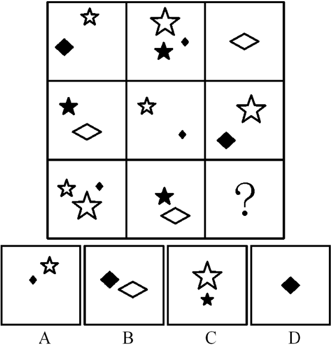
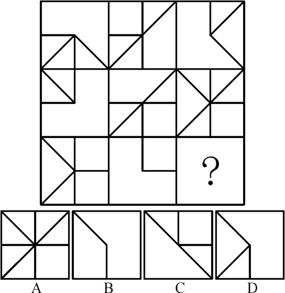
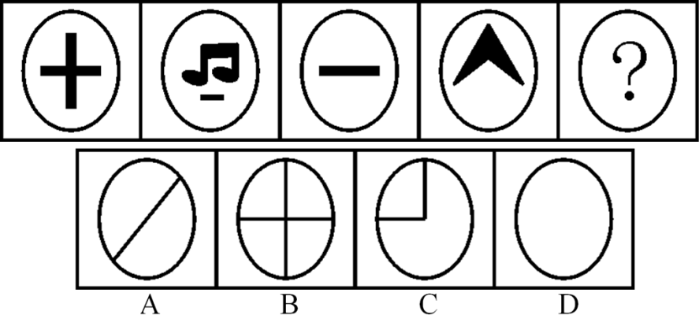
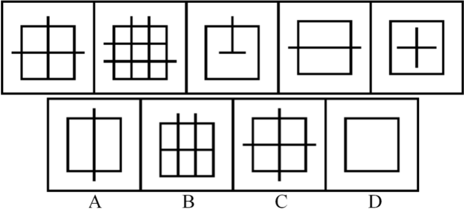
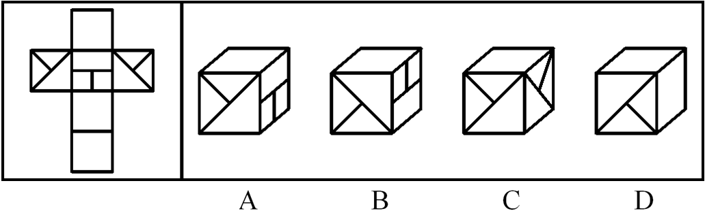

86 请从所给的四个选项中，选择最合适的一个填入问号处，使之呈现一定的规律性：

A 如上图所示  
B 如上图所示  
C 如上图所示  
D 如上图所示  
::: details
第一行共6个元素，第二行也由相同的6个元素构成，只是排列组合不同，确定规律为每行元素的遍历；第三行中仅缺少一个“◆”，只有D项符合。
:::

87 请从所给的四个选项中，选择最合适的一个填入问号处，使之呈现一定的规律性：

A 如上图所示  
B 如上图所示  
C 如上图所示  
D 如上图所示  
::: details
第一行共6个元素，第二行也由相同的6个元素构成，只是排列组合不同，确定规律为每行元素的遍历；第三行中仅缺少一个“◆”，只有D项符合。
:::

88 请从所给的四个选项中，选出最符合左边五个图形一致性规律的选项：

A 如上图所示  
B 如上图所示  
C 如上图所示  
D 如上图所示  
::: details
第一行共6个元素，第二行也由相同的6个元素构成，只是排列组合不同，确定规律为每行元素的遍历；第三行中仅缺少一个“◆”，只有D项符合。
:::

89 请从所给的四个选项中，选出最符合左边五个图形一致性规律的选项：

A 如上图所示  
B 如上图所示  
C 如上图所示  
D 如上图所示  
::: details
第一行共6个元素，第二行也由相同的6个元素构成，只是排列组合不同，确定规律为每行元素的遍历；第三行中仅缺少一个“◆”，只有D项符合。
:::

90 请从所给的四个选项中，选出最符合左边五个图形一致性规律的选项：

A 如上图所示  
B 如上图所示  
C 如上图所示  
D 如上图所示  
::: details
第一行共6个元素，第二行也由相同的6个元素构成，只是排列组合不同，确定规律为每行元素的遍历；第三行中仅缺少一个“◆”，只有D项符合。
:::

